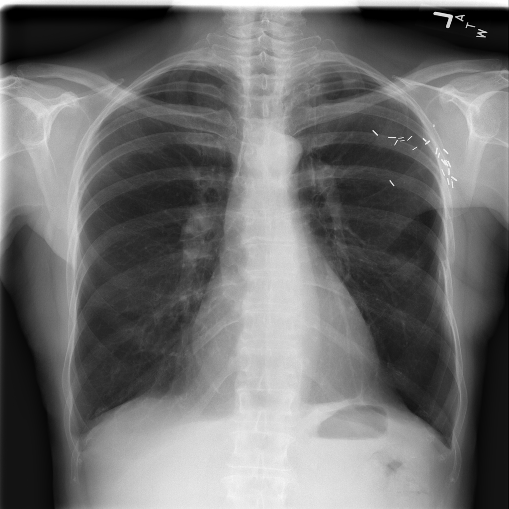
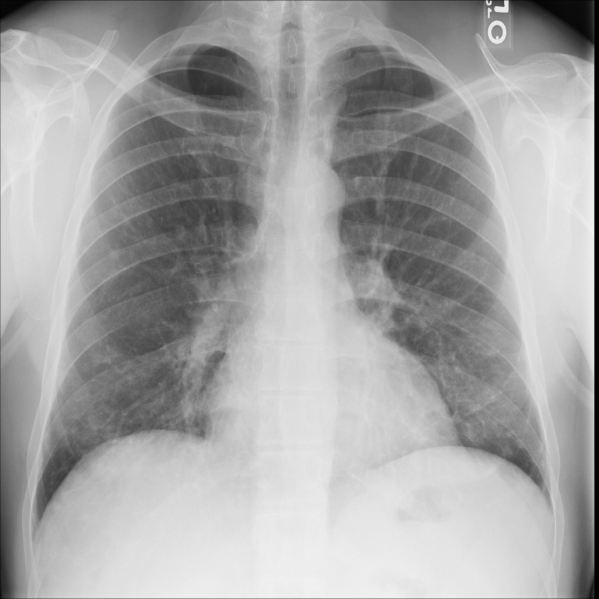
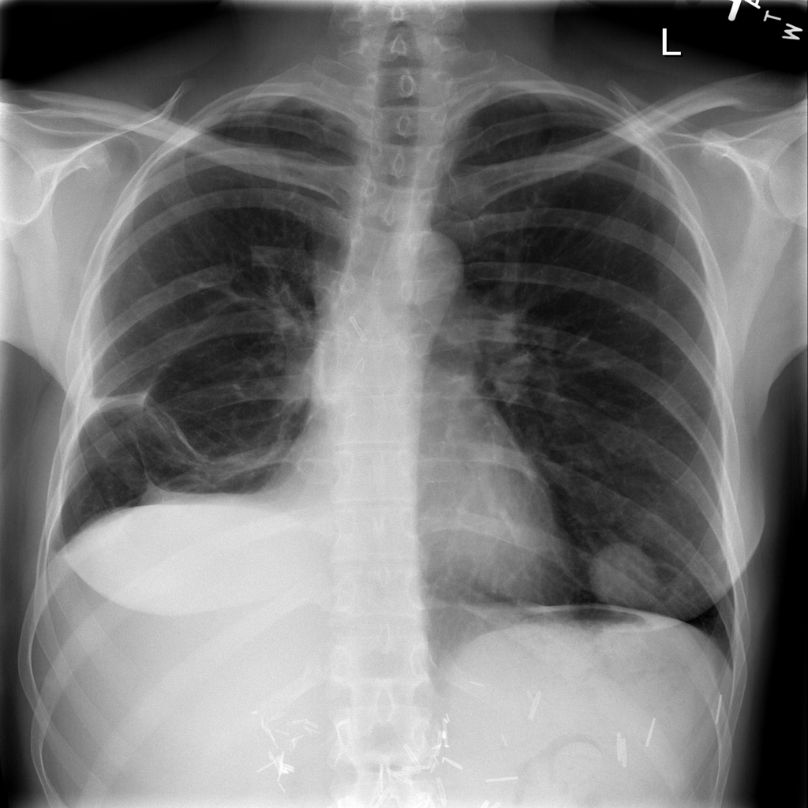
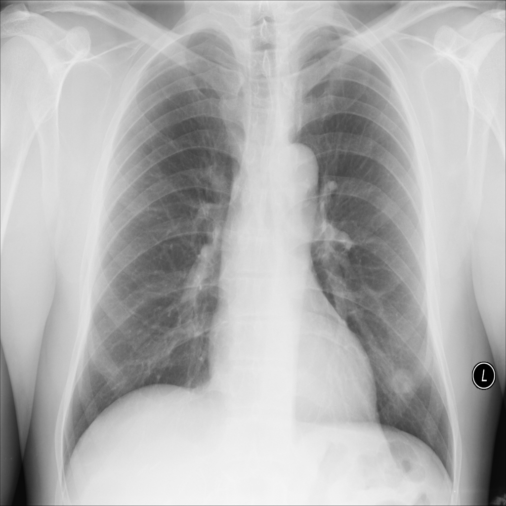

<div align="center">
  
  <h2>Medical Imaging & Condition Prediction</h2>
  <p>An AI-powered web application for Chest X-ray generation and condition classification using deep learning architectures (PyTorch & Transformers).</p>
  <p><strong>🌐 Live Application:</strong> <a href="https://medi-minds.onrender.com">https://medi-minds.onrender.com</a></p>
</div>

---

### 🏥 Overview

This project focuses on leveraging Artificial Intelligence in Healthcare. It provides a robust, dual-purpose medical web interface:
1. **Synthetic Image Generation:** Generates highly accurate, synthetic Chest X-ray images using a Generative Adversarial Network (GAN). This is crucial for advancing medical imaging and augmenting datasets without relying on sensitive patient data.
2. **Medical Prediction:** Predicts lung conditions (Normal, Pneumonia, or COVID-19) from Chest X-ray uploads using a fine-tuned Hugging Face Vision Transformer (ViT) model (`dima806/chest_xray_pneumonia_detection`).

### ✨ Features
- **Interactive UI:** A beautifully designed frontend tailored for medical applications.
- **Deep Learning Integration:** Powered by PyTorch models handling heavy generation workloads and Transformers managing highly accurate classifications.
- **Live Previews:** Users can preview uploaded X-rays instantly before predictions.
- **Dynamic Analysis:** Generates synthetic samples on-the-fly and presents a detailed, interactive result gallery.

---

### 🖼️ Sample Generated Data

Our GAN-based generator model creates realistic synthetic variations of patient Chest X-rays. 

<div align="center">
  
  
</div>
<div align="center">
  
  
</div>

---

### 🚀 Getting Started Locally

Follow these steps to run the Flask application on your local machine:

**1. Clone the repository**
```bash
git clone https://github.com/your-username/your-repo-name.git
cd your-repo-name
```

**2. Create a Virtual Environment (Optional but Recommended)**
```bash
python -m venv venv
source venv/bin/activate  # On Windows use: venv\Scripts\activate
```

**3. Install Dependencies**
```bash
pip install -r requirements.txt
```

**4. Run the Application**
```bash
python app.py
```
> The application will be running locally at `http://127.0.0.1:5000/`.

---

### ☁️ Deployment (Render)

This application is configured for seamless deployment on **Render.com's** free tier.

1. Push your code to GitHub.
2. Log into Render and create a new **Web Service**.
3. Link your GitHub repository.
4. Set the **Build Command**:
   ```bash
   pip install -r requirements.txt
   ```
5. Set the **Start Command**:
   ```bash
   gunicorn app:app
   ```
6. Click Deploy! 

*(Note: The `requirements.txt` specifically targets the PyTorch CPU wheels to ensure it fits comfortably within free tier memory limits).*

---

### 🛠️ Technology Stack
- **Backend:** Flask, Python, Gunicorn
- **Deep Learning Frameworks:** PyTorch, Hugging Face Transformers (`ViTImageProcessor`)
- **Frontend:** HTML5, CSS3, Bootstrap, JavaScript
- **Image Processing:** Pillow, Torchvision
